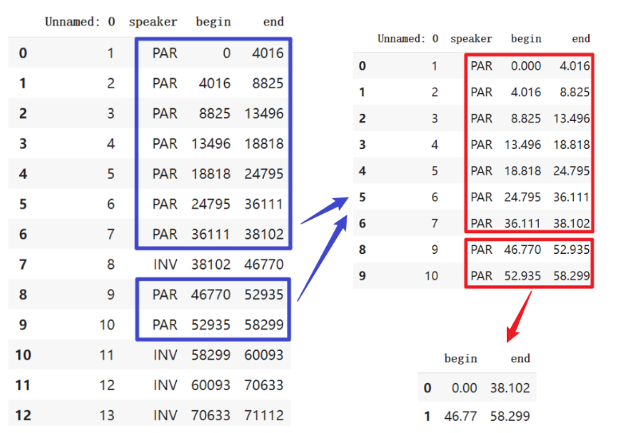
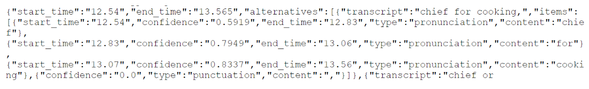
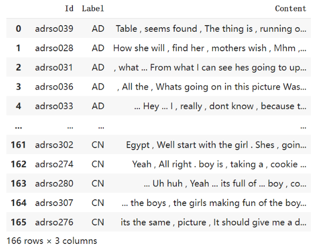

## Using speech and language to identify patients at risk for hospitalizations and emergency department visits in homecare
## Update 2022-06-22 - Implementation summary  
Last two weeks, I put my attention to the preprocessing state. I will review the main idea then explain the concrete implementation details.  

### Main Idea and Review:

Although there are a lot of acoustic representations that can be used in the prediction of the model, we have to admit that the pre-train model like BERT, which only takes advantage of linguistic representations, shows better performance according to the conclusions of many papers. Therefore, two kinds of problems arise:
How to obtain more accurate transcription.
How to merge the important acoustic features into the transcription text.
Since we have already had the transcript from AWS, I will focus on the implementation of the second point. Among dozens of acoustic representations, intuitively, disfluency and pause have a strong relationship to the classification of AD. Therefore, representing pauses as particular punctuation corresponding to certain word embedding would be a straightforward approach.

Code is here: 
Disfluency and Pause.ipynb
Located in development/code
Direct link
https://colab.research.google.com/drive/1lWTHkNE51vt7lICvWjVQezDOsqkyXexe?usp=sharing

### Implementation Details:
In previous works, transcripts were archived as json files in forms of a verbatim display of its start time and end time. There are also time divisions for different speakers. Only the segmentation parts of PATIENTS can be included in model training.
What I have done can be mainly concluded as two parts. I will first introduce the whole technical flow (briefly in previous works and detaily in my works). Then demonstrate the results of different modifications by some measuring metrics.

#### Segmentation merging
There are two parts of files which can be used as the input: transcription Json files (https://drive.google.com/drive/u/0/folders/1HsG6OG8z647enc1nfhhb96SnTJU4jZfa) and segmentation files (https://drive.google.com/drive/u/0/folders/1_PTncLEdsfhwIitrd2pcja880LvelXtq).
In the original segmentation files, it marks the beginning time and end time of different speakers, as shown in the left subfigure below. Since we only need the content of patients, we only select the rows with PAR speakers.
However, the original segmentation is on the basis of clauses. Each clause will have a corresponding time segmentation in Json files, it includes the segmentation of words. While the begin time and end time of the two files are not exactly matching. Let’s take a easy example of certain file (original-AD-adrso039.wave-3.json “/DementiaBank.20210603/ADReSSo2021/diagnosis/train/transcription/original-AD-adrso039.wav-3.json” and adrso039.csv “/DementiaBank.20210603/ADReSSo2021/diagnosis/train/segmentation/AD/adrso039.csv”) 

  
adrso039.csv

  
original-AD-adrso039.wave-3.json 

The original transcript is like this

    Table seems found. The thing is running over chief for cooking, drying dishes, sauces long and then this. You see anything else? Well, yeah. Here's some outside wonder guarding against. Okay. Okay. Good.

After removing the punctuations and INV segmentations, it will changed to

    Table seems The thing is running over chief for drying dishes sauces long and then this Well yeah Heres some outside guarding against
If segmentation merging applied, it will be like

    Table seems found The thing is running over chief for cooking drying dishes sauces long and then this Well yeah Heres some outside wonder guarding against

It is not difficult to find that the bold words are missed in the previous work, especially when the word is the boundary of two clauses. Since we have so few texts to begin with, the loss of words can have unforeseen consequences. 

#### Pause representations
Since we have had the start time and end time of every word, we can judge whether there is an interval between two words, then we can regard it as a pause. We simply assume that there are three kinds of pause that are respectively represented by different symbols.

pauses = {"short": ",", "medium": ".", "long": "..."}

Therefore, we can insert the “pause punctuation” into the text, as shown below.

Table , seems found , The thing is , running over ... chief for , cooking , drying , dishes , sauces ... long , and , then ... this , Well yeah Heres some ... outside ... wonder . guarding against

All files can be processed as shown above. Associated with its file ID and classification label, I output the integrated CSV file of preprocessing.

### Evaluation
